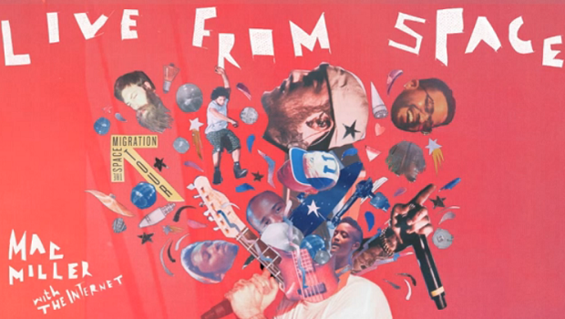

```html
<style>
  .overflow-hidden {
    overflow: hidden;
  }
  .bg-gray-800 {
    background-color: rgb(31, 41, 55);
  }
  .rounded {
    border-radius: 4px;
  }
  .p-4 {
    padding: 1rem;
  }
  .text-lg {
    font-size: 1.25rem;
  }
  // and others ...
</style>

<div className="overflow-hidden bg-gray-800 rounded">
  

  <div className="p-4">
    <h2 className="text-lg text-gray-100">Utility-first CSS</h2>
    <p className="text-gray-200">
      We build a while suite of utility classes that respect the design system primitives. The
      amazing thing about this is that before you know it, you can build entirely new UI components
      without writing any new CSS.
    </p>
  </div>
</div>
```
